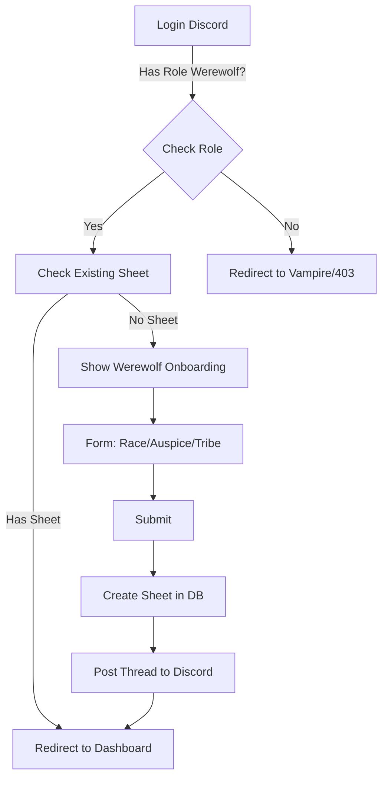

# UX Design Specification the-world-of-darkness

**Author:** Zaès
**Date:** 2026-01-20

---

<!-- UX design content will be appended sequentially through collaborative workflow steps -->

## Résumé Exécutif

### Vision du Projet

Le module "Loup-Garou" étend la plateforme World of Darkness existante en ajoutant l'univers des Garous, tout en conservant la philosophie stricte du serveur : **100% immersion narrative, 0% mécanique visible.**

Comme pour le module Vampire actuel, l'interface sert de support d'écriture pur. Elle s'offre aux joueurs ayant le rôle Discord approprié, leur fournissant un espace privé pour rédiger leur histoire, qui est ensuite automatiquement publiée sur le forum Discord communautaire.

### Utilisateurs Cibles

*   **Le Joueur (Rôle Garou) :** Il utilise le site pour définir son personnage (Race, Auspice, Tribu) et rédiger sa fiche. Il a besoin d'une interface simple, stable et inspirante pour écrire.
*   **Le MJ :** Il utilise le site pour valider les Hauts Faits (progression du Rang) et débloquer les Dons (récompenses narratives) sur les fiches des joueurs.
*   **L'Utilisateur Standard (Non-Garou) :** Il ne doit pas accéder à ce module. Le site le redirige ou masque ces pages pour préserver la séparation des univers.

### Défis de Conception Clés

*   **Cloisonnement Strict :** L'accès aux pages Loup-Garou doit être techniquement impossible sans le rôle Discord spécifique. La détection doit être immédiate.
*   **Simplicité de l'Outil :** L'interface ne doit être qu'un traitement de texte amélioré, sans fioritures (pas de jauges, pas de stats). Elle doit se faire oublier au profit du texte.
*   **Fiabilité de la Synchro :** La publication sur Discord (création/mise à jour de thread) doit être robuste, car c'est le seul lien avec les autres joueurs.

### Opportunités de Design

*   **Architecture Miroir :** Réutiliser la structure éprouvée du module Vampire (Layouts, Composants, Logique) pour garantir la stabilité et réduire le temps de développement, en changeant juste l'ambiance visuelle (Thème).
*   **Zéro Friction :** Une expérience fluide où le joueur se connecte, écrit, et c'est en ligne. Pas de calculs, pas de validation système complexe.

## Expérience Utilisateur Principale

### Définition de l'Expérience

Le site est le **Tableau de Bord du Personnage** (Companion App). L'action principale est la **Consulation et la Gestion** de ses données (Fiche, Dons, Histoires). L'écriture RP pure se fait sur Discord. Le site sert de référence "Vérité Terrain" pour l'état du personnage.
L'expérience doit être familière pour les joueurs actuels (base Vampire), mais avec une identité visuelle et terminologique propre aux Loups-Garous.

### Stratégie Plateforme

*   **Copier-Coller Vampire :** On s'appuie à 100% sur l'existant. Si ça marche sur Vampire, ça marche ici.
*   **Desktop & Mobile :** Comme l'actuel, consultable partout, optimisé desktop.
*   **Switch Rôle :** La seule nouveauté technique majeure est le basculement d'interface selon le rôle Discord détecté.

### Interactions "Sans Effort"

*   **Continuité :** L'utilisateur qui connaît le site Vampire ne doit pas être perdu. Mêmes menus, même logique, juste un "skin" et des champs différents.
*   **Mise à jour Fiche :** Éditer sa fiche ou ajouter un Haut Fait doit être aussi simple que sur la version actuelle.

### Moments Critiques de Succès

1.  **L'Identité Visuelle :** L'utilisateur doit immédiatement sentir qu'il est "chez les Garous" (couleurs, ambiance) et pas sur une page Vampire buggée.
2.  **La Cohérence :** Les données affichées (Rangs, Dons) doivent correspondre exactement à ce qui est attendu par le système de jeu, sans erreur de mapping.

### Principes d'Expérience

1.  **Robustesse avant tout :** On privilégie la stabilité du code existant.
2.  **Adaptation, pas Innovation :** On garde les patterns UX qui marchent (Sidebar, Formulaire) et on change le contenu.
3.  **Support au RP :** Le site facilite le jeu sur Discord, il ne le remplace pas.

## Réponse Émotionnelle Désirée

### Objectifs Émotionnels Primaires

1.  **L'Appartenance (Belonging) :** L'utilisateur doit se sentir "entre nous". L'interface est un repaire privé, distinct du reste du monde (et du site Vampire). C'est le sentiment de la Meute.
2.  **La Fluidité (Ease) :** L'outil ne doit jamais frustrer. Il doit inspirer confiance par sa stabilité et son évidence. "Ça marche, tout simplement".

### Parcours Émotionnel

*   **Connexion :** *Validation*. "Le site me reconnaît, je suis un Garou".
*   **Lecture de Fiche :** *Fierté*. "Voici mon histoire, mes Hauts Faits, mon identité".
*   **Mise à Jour :** *Simplicité*. "J'ajoute une info sans douleur".
*   **Sauvegarde :** *Sérénité*. "Je sais que c'est préservé et partagé".

### Micro-Émotions

*   **Confiance :** En voyant les données synchronisées correctement.
*   **Intimité :** En naviguant sur une interface sombre, tribale, "organique" (vs le gothique aristocratique Vampire).
*   **Satisfaction :** Quand une demande de Renommée est validée et que le Rang change visuellement.

### Implications de Design

*   **Thématique Visuelle :** Utiliser des tons terreux, naturels, sauvages (Ambre, Brun, Vert Forêt sombre) et des textures (Papier, Bois, Pierre) pour évoquer le Primitif, par opposition au Velours/Marbre/Sang des Vampires.
*   **Vocabulaire :** L'interface doit parler "Garou" (Meute, Caern, Esprits) dans ses feedbacks, pas "Admin" ou "System".

## Analyse des Patterns UX & Inspiration

### Analyse du Produit Inspirant : World of Darkness (Vampire Module)

C'est la référence absolue ("Gold Standard"). Le module Vampire a déjà résolu les problèmes complexes de gestion de fiche narrative. L'objectif est de capitaliser sur cette base solide tout en étendant les capacités pour le Loup-Garou.
*   **Ce qui marche :** L'approche "Formulaire Discret" (champs texte simples), l'architecture technique robuste, et la séparation nette entre les fonctionnalités.
*   **Pourquoi ça reste :** Les utilisateurs ont déjà appris cette interface. La charge cognitive pour passer au Garou sera nulle si on conserve les repères fondamentaux.

### Patterns Transférables

1.  **Architecture de Page (Top Bar) :** On garde le standard Desktop (Barre de navigation en haut) qui est efficace et connu. La Sidebar sera utilisée contextuellement sur Mobile ou pour des sous-menus spécifiques, comme c'est le cas actuellement.
2.  **Moteur de Fiche :** Le coeur du système (Inputs, Textareas, Selects, Sauvegarde) est repris tel quel. Pas de réinvention de la roue pour la saisie de données.
3.  **Flux de Validation :** Le pattern existant "Soumettre -> En attente -> Validation MJ" est parfait pour être réutilisé, même si le contenu (Hauts Faits) est différent.

### Nouvelles Fonctionnalités Spécifiques

Contrairement aux Vampires, le Loup-Garou nécessite des modules inédits que nous développerons spécifiquement :
1.  **Gestion des Dons :** Interface spécifique (Catalogue / Déblocage MJ) à créer de zéro car elle n'a pas d'équivalent direct (Discipline != Don).
2.  **Système d'Histoires :** Module narratif complet pour la soumission et validation de Hauts Faits, conçu spécifiquement pour le besoin Garou.
3.  **Flexibilité :** Nous nous autorisons à créer toute fonctionnalité supplémentaire demandée qui servirait spécifiquement l'expérience Garou, sans être bridés par "ce que fait Vampire".

### Anti-Patterns à Éviter

1.  **Le "Skin" Vampire :** Il faut bannir tout vestige gothique/victorien (polices à empattement excessif, rouge sang, velours).
2.  **Complexité Inutile :** Ne pas reproduire des mécaniques Vampire (Soif, Sang) qui n'ont pas de sens ici.
3.  **Confusion de Navigation :** Ne pas mélanger les menus Vampire et Garou. L'utilisateur ne voit que ce qui concerne son rôle.

### Stratégie d'Inspiration Design

*   **Adopter :** Le "Shell" de l'application (Auth, Routing, Layout Global) et le moteur de Fiche de base.
*   **Adapter :** Le Design System (Visual Identity) pour basculer de l'ambiance Vampire à l'ambiance Garou.
*   **Créer :** Les modules "Dons" et "Histoires" qui seront des développements sur-mesure.

## Fondation du Design System

### 1.1 Choix du Design System

**Custom Design System Existant (Projet World of Darkness)**.
Nous n'allons pas introduire de nouvelle librairie UI. Nous utilisons les composants React et le CSS existants du module Vampire.

### Raison de la Sélection

*   **Cohérence Totale :** Garantit que le module Loup-Garou s'intègre parfaitement au reste du site (même "toucher", mêmes comportements).
*   **Vitesse de Dév :** Les composants (Button, Card, Modal) sont déjà codés et testés.
*   **Performance :** Pas de bundle size supplémentaire lié à une grosse lib tierce.

### Approche d'Implémentation

*   **Thématisation CSS :** Création d'un fichier `werewolf-theme.css` qui surcharge les variables CSS root (ex: `--primary-color: #8B0000` -> `--primary-color: #556B2F`).
*   **Composants Partagés :** Les composants React sont agnostiques du thème. Ils utilisent les variables CSS pour s'afficher.

### Stratégie de Personnalisation

*   **Palette "Gaia" :** Tons terreux (Marron, Ocre, Vert Sapin) et textures "Papier/Parchemin".
*   **Typographie :** Conservation des polices de corps pour la lisibilité, changement de la police de Titre pour une touche plus "tribale/sauvage".

## 2. Expérience Utilisateur Principale

### 2.1 Expérience Définitive

L'expérience centrale n'est pas l'écriture, mais **"La Maintenance du Sanctuaire"**. L'utilisateur revient sur sa fiche pour deux raisons précises :
1.  **Consulter une référence** (Relire ses Dons, vérifier son Rang).
2.  **Acter une évolution** (Ajouter un Haut Fait, mettre à jour son Histoire).
C'est une interaction brève, précise et satisfaisante, comme mettre à jour un journal de bord.

### 2.2 Modèle Mental Utilisateur

*   **Attente :** "C'est ma feuille de personnage papier, mais intelligente et toujours propre".
*   **Friction Actuelle :** Sur Discord ou GDocs, l'info est dispersée.
*   **Solution Magique :** Tout est centralisé. Je ne calcule rien, le site connaît mes règles (Tribus, Rangs) mieux que moi.

### 2.3 Critères de Succès

1.  **L'Accès Instantané :** Je clique sur le lien, je suis sur ma fiche. 0 seconde de recherche.
2.  **La Validation Visuelle :** Quand je sauve, je *vois* que c'est pris en compte (Feedback immédiat).
3.  **La Clarté :** Je ne cherche jamais où est l'info "Dons". C'est évident.

### 2.5 Mécanique de l'Expérience (Flow de Base)

1.  **Initiation :** Lien depuis Discord ou Favori navigateur.
2.  **Interaction :**
    *   *Lecture :* Scroll fluide, typographie lisible.
    *   *Édition :* Clic sur "Modifier", champs s'ouvrent in-place (pas de changement de page).
3.  **Feedback :** Toast de succès "Sauvegardé & Synchronisé".
4.  **Complétion :** L'utilisateur ferme l'onglet avec le sentiment du devoir accompli.

## Fondation du Design Visuel

### Système de Couleurs (Palette Gaia)

Nous remplaçons la palette "Blood & Velvet" du module Vampire par la palette "Gaia & Rage" :
*   **Primaire (L'Appel) :** `Ambre Brûlé (#CC7722)` (au lieu du Rouge Sang). Sert aux boutons d'action et highlights.
*   **Secondaire (La Meute) :** `Vert Forêt Profond (#2F4F4F)` (au lieu du Noir/Violet). Sert aux fonds de section et sidebars.
*   **Fond (Le Territoire) :** `Beige Parchemin (#F5F5DC)` ou `Gris Pierre (#3C3C3C)` en Dark Mode. Remplace le Noir pur pour une texture plus organique.
*   **Alerte (La Rage) :** `Rouge Vif (#FF0000)` conservé pour les erreurs et la mécanique de Rage.

### Système Typographique

*   **Corps (Lisibilité) :** Conservation de la police actuelle (ex: *Roboto* ou *Lato*) pour garantir que les longs textes RP restent lisibles.
*   **Titres (Identité) :** Adoption d'une police avec plus de caractère "brut/gravé" (ex: *Cinzel* ou *Bitter*) pour les H1/H2, remplaçant la police gothique des Vampires.

### Espacement et Layout

*   **Densité :** On garde la densité "Confortable" actuelle. L'écriture demande de l'air.
*   **Grille :** Conservation du Container centré (max-width 1200px) pour la fiche.

### Considérations d'Accessibilité

*   **Contraste :** Le passage aux tons terreux (Marron/Vert) ne doit pas nuire au contraste du texte. Validation WCAG AA requise sur les boutons Ambre/Blanc.

## Décision de Direction Design

### Directions Explorées

1.  **Gaia Classic (Direction A) :** Ambiance "Papier & Encre", lumineuse et traditionnelle.
2.  **Wild Spirit (Direction B - *Refusée*) :** Version initiale trop sombre/noire ("Dark UI" générique).
3.  **Deep Woods (Direction B - *Retenue*) :** Version affinée avec des tons chauds, boisés et profonds.

### Direction Choisie

**Direction B Affinée : "Deep Woods" (La Forêt Profonde)**

### Raison du Choix

L'utilisateur a rejeté le "Noir Plat" pour préférer une ambiance plus organique et texturée ("Boisé").
*   **Identité :** C'est une "Cabane au fond des bois", pas une interface futuriste ou gothique.
*   **Confort :** Le contraste "Or Antique sur Noyer Sombre" est reposant et très lisible pour de longues sessions d'écriture nocturnes.

### Approche d'Implémentation

*   **Palette Finale :**
    *   Fond : Noyer Sombre (`#1a110a`)
    *   Surface Cards : Chêne Sombre (`#261a12`)
    *   Textes : Blanc Os (`#E8DCC5`)
    *   Accents/Boutons : Or Antique (`#C19A6B`)
*   **Textures :** Utilisation subtile de bruit ou de grain bois sur les backgrounds pour casser l'aspect plat du CSS.

## Parcours Utilisateur

### Parcours 1 : Le Premier Pas (Onboarding)
L'utilisateur avec le rôle Discord `Werewolf` se connecte pour la première fois.
*   **Trigger :** Login avec Discord.
*   **Action :** Le site détecte le rôle -> Redirige vers `/werewolf/create`.
*   **Saisie :** Choix Race, Auspice, Tribu (Irréversible).
*   **Succès :** Création de la Fiche et Premier Post automatique sur Discord.



### Parcours 3 : La Gloire (Demande de Renommée)
L'utilisateur veut valider un acte héroïque accompli en RP.
*   **Trigger :** Clic sur "Ajouter un Haut Fait".
*   **Saisie :** Titre, Description, Type (Gloire/Honneur/Sagesse).
*   **Feedback :** "Envoyé aux Esprits (MJ)".
*   **Résultat :** Notification Discord quand validé + Mise à jour du Rang sur la fiche.

```mermaid
graph TD
    A[Click 'Add Renown'] --> B[Modal Input: Title/Story]
    B --> C[Submit]
    C --> D[Save to DB (Status: Pending)]
    D --> E[Notify MJ (Discord Channel)]
    E --> F[MJ Validates on Dashboard]
    F --> G[Update Sheet Rank]
    G --> H[Notify Player]
```

### Patterns d'Optimisation
*   **Zéro Page Blanche :** Les champs "Histoire" sont pré-remplis avec des prompts ("Comment avez-vous vécu votre Premier Changement ?").
*   **Feedback Immédiat :** Les sauvegardes sont autosaves (façon GDocs) pour ne jamais perdre une idée.

## Stratégie des Composants

### Composants Design System (Fondation)
Nous réutilisons massivement les composants "Vampire Code" existants, simplement re-thémés via CSS :
*   **Base :** `Button`, `Input`, `Select`, `Card`, `Modal`, `Toast`.
*   **Structure :** `Layout`, `Sidebar`, `TopBar`.
*   **Implémentation :** Pas de duplication de React. Juste un contexte de thème CSS.

### Composants Spécifiques (Custom Werewolf)
Nous créons uniquement ce que Vampire n'a pas :

1.  **`GiftCard` (Carte de Don) :**
    *   *But :* Afficher un Don, son Niveau, sa Tribu, et son état.
    *   *États :* Verrouillé (Grisé/Mystérieux), Débloqué (Actif/Doré).
    *   *Interaction :* Clic pour voir les détails (Coût Gnose, Effet système).

2.  **`RenownBadge` (Insigne de Rang) :**
    *   *But :* Afficher visuellement la progression du rang (ex: Cliath -> Fostern -> Adren).
    *   *Visuel :* Icône de Lune progressive ou glyphe tribal. Remplace la "Blood Potency".

3.  **`StoryEditor` (Plume) :**
    *   *But :* Zone de texte enrichie dédiée au RP.
    *   *Features :* Auto-save, compteur de mots, mode "Focus" (plein écran).

### Stratégie d'Implémentation
*   **Dossier :** `src/components/werewolf/` pour isoler ces customs.
*   **Style :** Utilisation stricte des variables `--wild-*` définies dans le thème.
*   **Tech :** React fonctionnel + SCSS Modules.

## Patterns de Cohérence UX

### Hiérarchie des Boutons
*   **Primaire (Ambre) :** Action principale positive (Sauvegarder, Créer, Valider). Un seul par vue.
*   **Secondaire (Outline) :** Actions alternatives (Annuler, Retour).
*   **Ghost (Lien) :** Navigation contextuelle.

### Feedback & Notifications
*   **Succès :** Toast vert forêt en bas à droite ("Sauvegardé").
*   **Attente :** Spinner "Lune" rotatif au centre.
*   **Erreur :** Toast rouge vif ("Impossible de synchroniser").

### Patterns de Navigation
*   **Fil d'Ariane :** Présent sur toutes les pages enfants (ex: Dashboard > Fiche > Historique).
*   **Sortie :** L'Avatar en haut à droite est le point de sortie (Logout/Profil).

### Formulaires et Validation
*   **Validation :** "On Blur" (quand on quitte le champ) pour ne pas agresser l'utilisateur pendant la frappe.
*   **Erreurs :** Affichées sous le champ concerné en rouge, avec un message explicite.

## Responsive & Accessibilité

### Stratégie Mobile First
*   **Priorité :** Accès en lecture (Fiche, Dons) optimisé pour Smartphone.
*   **Navigation :** Passage en Menu Hamburger ou Bottom Nav pour les écrans < 768px.
*   **Tableaux :** Les tableaux de Dons/Hauts Faits se transforment en "Liste de Cartes" sur mobile pour éviter le scroll horizontal.

### Stratégie d'Accessibilité (WCAG AA)
*   **Contraste Critique :** Le texte de lecture sera toujours `Blanc Os (#E8DCC5)` sur fond `Sombre (#1a110a)` = Ratio 13:1 (Excellent).
*   **Pas de texte Or :** La couleur Or/Ambre est réservée aux bordures et gros titres, jamais pour le corps de texte.
*   **Focus :** Tous les éléments interactifs auront un outline visible au clavier.
