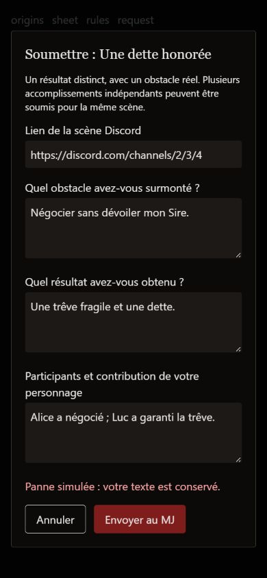

# Corrections et seconde lecture — Vampire RP

Les principaux blocages de l’audit ont été corrigés dans le dépôt. La compilation et les vérifications locales permettent de préparer un pilote ; elles ne valident pas encore une ouverture du service publié. L’activation du secret Apps Script, le déploiement coordonné et une recette avec un vrai compte Discord restent nécessaires. Voir [la procédure de mise en service](../vampire-mise-en-service.md).

## Changements apportés

| Domaine | Résultat |
|---|---|
| Identité et droits | Jeton Discord vérifié côté serveur, application OAuth contrôlée, utilisateur dérivé de cette preuve, appartenance au serveur et rôle Vampire vérifiés. Accès interserveur aux PNJ refusé. Les appels du module Loup-garou transmettent aussi le jeton puisque l’API est commune. |
| Google Sheets | Les lectures et écritures du navigateur passent par le serveur. Le script refuse les GET publics et exige un secret en POST. Le navigateur ne peut pas écrire la puissance, les points ou l’historique via le nouveau point d’entrée. |
| Sauvegarde | Sauvegarde de fiche distinguée de la publication Discord et de la synchronisation du nom. Reprise proposée en cas d’échec. Identifiant du message Discord conservé côté serveur. Les longues descriptions sont découpées sous la limite Discord. |
| PJ et PNJ | Lecture périodique du PJ suspendue en mode PNJ/Caïn ; résultats devenus obsolètes ignorés. Autosauvegarde globale supprimée au profit des actions explicites. Une modification de PNJ privé ne le publie plus automatiquement. |
| Progression | Demande comprenant scène Discord, obstacle, résultat et participants. Points et admissibilité contrôlés côté serveur. Identifiant durable de demande, reprise après panne, marqueur d’attribution dans la même écriture Sheets que la progression. Refus réparé et protégé contre une décision opposée. Excédents conservés, aucun plafond temporel ajouté. |
| Dépenses | Débit atomique de Vitae. Deux dépenses simultanées ne peuvent plus consommer davantage que la réserve ; une dépense impossible laisse celle-ci inchangée. |
| Narration | Trois questions ouvertes adaptées au clan, sans âge ou acte violent imposé. Anciennes réponses préservées. Désir immédiat, attache, limite du personnage et dette ajoutés à la fiche publiée. Secrets MJ explicitement orientés vers un échange privé. |
| Entrée en jeu | Guide de première nuit, amorces de scène, explication du rôle de Discord, de Tabulae, de Venatio et du panneau `/vampire`. |
| Contrat de jeu | Résistance mentale cohérente : supérieur immunisé, égal au coût de base, inférieur au coût augmenté. Durée d’une scène, conflit PJ, conséquences durables, pause, territoire et arbitrage précisés. Puissance séparée du titre et de l’ancienneté. |
| Ergonomie | Brouillons d’origine et de fiche, champs étiquetés, choix de clan et cartes de pouvoirs accessibles au clavier, formulaire de demande avec focus et Échap. Erreurs de service distinguées de l’absence de rôle. |
| Goules et rituels | Catalogue de goules partagé, Salubri inclus, pouvoir choisi et vérifié côté serveur. Formulaire conservé en cas d’échec. Ordre des hooks du lecteur de rituels corrigé. |
| Exploitation | Outil de sauvegarde SQLite sans écrasement, contrôle d’intégrité et exercice de restauration isolée. Vérifications Vampire ajoutées à l’intégration continue et avant construction du site déployé. |

## Résultats et portée des vérifications

- **131 tests web ciblés réussis**, répartis sur 19 fichiers : Vampire, données et socle commun.
- **24 tests Python réussis** : catalogue, identité falsifiée, droits, accès PNJ, refus et reprise, dépenses concurrentes, publication interrompue, découpage Discord, sauvegarde/restauration. Aucune base réelle utilisée.
- **3 tests Apps Script réussis** dans un environnement simulé : accès non signé refusé, attribution unique avec excédent, refus idempotent et impossibilité de changer ensuite la décision.
- Compilation de production réussie ; lint du périmètre Vampire et socle commun sans erreur ni avertissement.
- Suite web complète : **191 réussites, 5 échecs**, avec quatre fichiers Loup-garou en échec, comme au relevé initial (187 réussites, 5 échecs). Les quatre nouveaux tests de parcours passent. Les échecs préexistants concernent `RenownAdminPage`, `GiftsPage`, `CharacterSheet` et `CreateCharacter` ; le lint global comporte aussi encore des problèmes Loup-garou. Ils ne sont pas masqués par la commande de contrôle ciblée.
- Recette navigateur avec données fictives et appels distants désactivés : sélection clavier, aller-retour d’origine sans perte, formulaire de scène conservé après panne simulée, fermeture Échap et restitution du focus. Formulaire inspecté à 390 × 844 ; règles sans débordement horizontal dans la vue mobile. Cela reste une recette ponctuelle, pas une certification complète d’accessibilité.

La seconde lecture a aussi corrigé un défaut de refus d’action qui ne faisait aucune mise à jour, un appel à ce refus sans identifiant du validateur, et le risque d’écraser une progression récente lors d’une simple synchronisation de nom. Une régression introduite dans un test du catalogue par un renommage a été détectée puis corrigée avant la dernière relance.

Rectification de l’audit initial : une garde PNJ existait déjà dans le minuteur. Le problème portait sur ses dépendances et les réponses arrivant après un changement de personnage. L’audit initial a été annoté en conséquence ; aucune corruption réelle de PNJ n’a été provoquée.

## Ce qui reste à vérifier en situation réelle

1. **Mise en service obligatoire** : secret identique sur le bot et Apps Script, ancien déploiement public désactivé, bot et site mis à jour ensemble. Ces opérations distantes n’ont pas été réalisées pendant cette intervention.
2. **Chaîne Discord complète** : autorisations de salon, création et mise à jour du message de fiche, publication d’un PNJ, attribution de rituel, message de validation et notification. Les simulations ne prouvent pas les permissions du bot en production.
3. **Reprise distribuée** : l’attribution des points est protégée par un identifiant persistant. Une interruption exactement entre l’envoi d’un message Discord et l’enregistrement de son identifiant peut encore produire deux messages de demande ; leurs boutons ne doivent pas payer deux fois. La publication d’une nouvelle fiche conserve aussi une fenêtre de panne entre la création du fil et sa persistance locale. Prévoir une vérification MJ lors d’une reprise après panne sévère.
4. **Usage prolongé** : les éditions concurrentes de la même fiche ou du même registre ne disposent pas encore d’un écran de résolution de conflit. Les marqueurs de récompense sont stockés dans l’historique Sheets : surveiller sa taille et ne pas le tronquer sans migration. Le pilote doit confirmer cadence de progression et charge MJ.
5. **Éditorial** : les textes de clan restent volontairement sombres et parfois directifs ; les nouvelles questions ouvrent le choix sans réécrire toute la bibliothèque. Une harmonisation complète des pouvoirs, du vocabulaire et des représentations pourra suivre les retours des joueurs. Le choix des partenaires et les relations initiales restent des tâches de l’accueil/MJ, pas une affectation automatique.

**Décision : version locale prête pour une recette de mise en service, puis un pilote accompagné.** Ne pas annoncer le site publié comme sécurisé ou intégralement validé tant que les trois composants et les permissions Discord n’ont pas été vérifiés ensemble.

